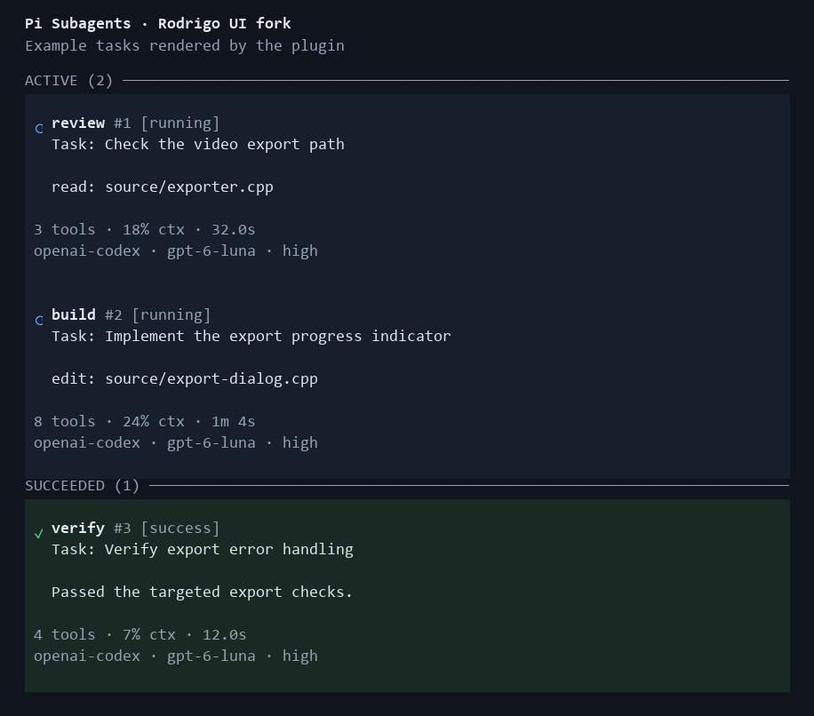

# Subagents for Pi — Rodrigo UI fork

This is Rodrigo's presentation fork of [mystilleef/pi-subagent](https://github.com/mystilleef/pi-subagent), based on upstream 0.12.4. Original authorship, license, process execution, agent definitions, and nested delegation are preserved.

Version **0.13.0-rodrigo.5** keeps delegated work visible and adds an optional durable execution adapter:

- Numbered run labels (`review #1`, `build #2`) replace random adjective/noun nicknames. Numbers increase within each Pi process; job UUIDs remain the cancellation identifiers.
- The delegated task appears in compact cards, before live tool activity. Expand a live card to read its full normalized task.
- Tool counts, context usage, elapsed time, and model appear below the task and activity.
- `/jobs` shows each task and its current activity; completed runs retain their task beside the outcome.
- Existing records with older instance names still render normally.
- With the compatible [Pi Agent Mailbox](https://github.com/rodrigojager/pi-agent-mailbox) extension loaded, root jobs run through its event-driven supervisor. Their terminal result reaches the originating session through its journal and replay. Nested children keep this extension's existing execution path. Without the mailbox, the original background path remains available.

The mailbox's `/mailbox legacy` and `/mailbox durable` commands select the path for new jobs in the current branch. They do not move or cancel jobs already running. Closing an interface does not cancel a mailbox worker; `/cancel-subagent` remains the explicit cancellation command. Do not reload a Pi session while its current work is active just to activate this version.

On Windows, process-tree cancellation starts `taskkill /T /F` asynchronously as soon as cancellation is requested. This also reaches descendants that detached from the child process. If it fails, termination records the failure and falls back to a direct signal instead of reporting that the tree was killed.

Unexpected child exits now retain their failure status. When the host exposes a termination signal, the result names it; otherwise it reports the nonzero exit code rather than treating a missing code as success. A child terminated after `agent_end` with a confirmed final answer still follows the existing grace-period completion rule.

```text
⟳ review #1 [running]
  Task: Check the video export path
  → read: source/exporter.cpp
3 tools · 18% ctx · 32.0s
openai-codex ･ gpt-6-luna ･ high
```

The example illustrates the layout; runtime values come from the child process.



Install this fork through GitHub:

```sh
pi remove npm:@mystilleef/pi-subagent
pi install https://github.com/rodrigojager/pi-subagent
```

Keep only one subagent implementation configured, then use `/reload` in an existing Pi session. Future updates: `pi update https://github.com/rodrigojager/pi-subagent`.

The fork is distributed through GitHub releases and source installation. The original npm package continues to point to upstream.

---

Designed to orchestrate agents for the
[SPAE framework](https://github.com/mystilleef/spae-framework). Agents
in
[action](https://raw.githubusercontent.com/mystilleef/pi-subagent/main/assets/parallel-agents-demo.mp4).

---

## Installation

**Install from GitHub:**

```sh
pi install https://github.com/rodrigojager/pi-subagent
```

**Try temporarily without installing:**

```sh
pi -e https://github.com/rodrigojager/pi-subagent
```

---

## Features

- **Asynchronous:** Agents always run in the background.
- **Parallel:** Run many agents simultaneously.
- **Isolated:** Each delegated task receives a separate context window.
- **Nested:** `Subagents` can spawn other `subagents`.
- **Simple:** No complex orchestration syntax.
- **Bloat-free:** No bundled agents. Write your own. Or use those from
  the [SPAE Framework](https://github.com/mystilleef/spae-framework).

---

## Usage

**Run an agent with an optional task:**

```text
/run agent [optional task]
```

**Examples:**

```text
/run spec implement google login screen
/run plan
/run inspect
/run build
/run verify
```

**Use natural language to launch agents in parallel:**

```text
use the work agent to write a poem about linux; use the commit agent to make
commits; use the query agent to summarize the project.
```

**Show active and completed jobs:**

```text
/jobs
```

**Cancel running `subagents`:**

```text
/cancel-subagent
```

---

## _SPAE_ Workflow

The official extension for the
[SPAE Framework](https://github.com/mystilleef/spae-framework). The
framework provides pre-built agents and skills for a structured, or
orchestrated, workflow.

### Structured

| Phase | Agent                     | Purpose                                       |
| ----- | ------------------------- | --------------------------------------------- |
| 1     | `/run spec <requirement>` | Distill requirements into `SPEC.md`           |
| 2     | `/run plan`               | Decompose `SPEC.md` into an atomic task graph |
| 3     | `/run inspect`            | Perform gap analysis and optimize `PLAN.md`   |
| 4     | `/run build`              | Carry out tasks from `PLAN.md`                |
| 5     | `/run verify`             | Verify implementation against `SPEC.md`       |

### Orchestrated

| Agent                            | Purpose                                       |
| -------------------------------- | --------------------------------------------- |
| `/run orchestrate <requirement>` | Run all phases of the `SPAE` workflow         |
| `/run prepare <requirement>`     | Run preparatory phases of the `SPAE` workflow |
| `/run spawn`                     | Spawn build agents for each task in a plan    |

---

## Agent definitions

This extension ships no agents. Define agents as Markdown files with
YAML `frontmatter` and a Markdown system prompt body.

### Discovery locations

- User-global agents: `~/.pi/agent/agents/*.md`
- Project-local agents: nearest `.pi/agents/*.md`

### Example of an agent file

**PATH:** _~/.pi/agent/agents/lifehacks.md_

<!-- prettier-ignore-start -->
```md
---
name: lifehacks
description: Daily lifehacks
replace_prompt: true
context: false
thinking: xhigh
skills: false
extensions: pi-mcp-adapter
tools: read, grep, find, ls, mcp
---

# Role

Embody an expert philosopher and life coach. Your specialize in
_lifehacks_.

## Workflow

- Research and deliver 3 _profound_ and _transformative lifehacks_.
- Expound upon each of them.
- Emit unmodified result to the calling agent.

## Directives

- Forbid `copular` verb forms.
- **Minimum** words. **Maximum** signal.
- Keep prose vivid but terse.
- Optimize prose for token and context efficiency.
- Use lists and sub-lists over paragraphs and long sentences.
- Use elegant, well-structured, idiomatic markdown.

## Constraints

- Operate in read-only mode.
- Forbid all write operations.
- **NEVER** wrap the entire result in a code block.
```
<!-- prettier-ignore-end -->

### Required front matter

```yaml
name: review
description: Review code for correctness and maintainability.
```

### Optional front matter

```yaml
tools: read, bash, edit
skills: code-review
extensions: git-summary
context: false
thinking: medium
provider: deepseek
model: deepseek-v4-flash
temperature: 0.7
top_p: 0.9
replace_prompt: true
```

- `tools`: Specifies a comma-separated list of enabled tools. Omission
  defaults to the child process default `toolset`.
- `skills`: Specifies a comma-separated list of enabled skills. Setting
  `false` disables all skills. Omission inherits the active workspace
  skills.
- `extensions`: Specifies a comma-separated list of enabled extensions.
  Setting `false` disables all extensions except core subagent
  extensions. Omission inherits the active workspace extensions.
- `context`: Controls the inclusion of project context files,
  `AGENTS.md`. Setting `false` excludes default workspace files from the
  child context window.
- `thinking`: Controls the model thinking level (values: `off`,
  `minimal`, `low`, `medium`, `high`, `xhigh`, `max`). `xhigh` and `max`
  are model-specific, opt-in levels. The child runner clamps
  unsupported levels to supported values and prints warnings.
- `provider`: Specifies the model provider. Requires setting the `model`
  field. Omission of the `model` field when defining a `provider`
  invalidates the agent configuration.
- `model`: Specifies the model identifier. Agent-level model settings
  override parent settings.
- `temperature`: Sets the sampling temperature. Accepts numeric values
  between `0.0` and `1.0` inclusive. Incorrect values trigger warnings
  during discovery and the system ignores them.
- `top_p`: Sets the sampling top-p value. Accepts numeric values between
  `0.0` and `1.0` inclusive. Incorrect values trigger warnings during
  discovery and the system ignores them.
- `replace_prompt`: Set `true` to replace the child system prompt base
  with the agent body. Omitted or `false` appends the body to the
  existing system prompt, `SYSTEM.md`, preserving current behavior.
  Requires a non-empty agent body; `replace_prompt: true` with an empty
  or whitespace-only body fails discovery. **Warning:** `true` replaces
  pi built-in defaults and any project/global `SYSTEM.md`, including
  their safety and behavior guardrails.

---

## Tool

The extension also registers a `subagent` tool for model-driven
delegation.

**Inputs:**

- `agent`: agent name.
- `task`: task prompt for the child agent.
- `agentScope`: optional lookup scope, one of `user`, `project`, or
  `both`.
- `debug`: optional flag that requests child diagnostic details. Full
  child messages and raw internals require `PI_SUBAGENT_DEBUG_ENABLED=1`
  in the host environment.

---

## Security

`Subagents` launch child `pi --json` processes. Agents, tools, and
extensions run with user permissions, so treat agent definitions like
executable automation.

**Trust guidance:**

- Review project-local agents before running them.
- Avoid delegating secrets unless the agent and tools need them.
- Treat child-agent prompts, tool arguments, `stderr`, and debug
  transcripts as potentially sensitive.
- Enable debug details only for trusted investigations. `debug: true` or
  `/run --debug` can expose child conversation transcripts, termination
  internals, and `stderr` only when the host explicitly sets
  `PI_SUBAGENT_DEBUG_ENABLED=1`.
- Prefer trusted repositories for shared agent definitions.
- Remember that child agents can call their configured tools.

---

## Configuration and limits

**Environment variables:**

- `PI_SUBAGENT_DEPTH`: current nested subagent depth counter set
  internally for child processes.
- `PI_SUBAGENT_MAX_DEPTH`: max nested subagent depth. Default: `3`.
  Values above `10` clamp to the internal ceiling `10`; deeper nesting
  increases cost, latency, and runaway delegation risk.
- `PI_SUBAGENT_AGENT_END_GRACE_MS`: child process grace period after
  `agent_end` before forced termination. Default: `250`.
- `PI_SUBAGENT_MAX_STDERR_BYTES`: max captured child `stderr` bytes.
  Default: `10000`.
- `PI_SUBAGENT_MAX_OUTPUT_BYTES`: max returned output bytes. Default:
  `50000`.
- `PI_SUBAGENT_MAX_OUTPUT_LINES`: max returned output lines. Default:
  `500`.
- `PI_SUBAGENT_DEBUG_ENABLED`: debug detail authorization. Set to `1` to
  allow `debug: true` or `/run --debug` to include sanitized child
  messages, termination internals, and `stderr`; unset values keep
  non-debug detail behavior.

Limit variables parse as positive integers. Empty, zero, negative,
decimal, `Infinity`, and non-numeric values fall back to defaults.

---

## Troubleshooting

**Missing agent:**

- Confirm the file lives under `~/.pi/agent/agents/` or the nearest
  `.pi/agents/`.
- Confirm `frontmatter` includes `name` and `description`.
- Confirm `/run` uses the `name` value, not the filename.

**Project-local agent prompt:**

- Pi may request confirmation before loading project-local agents when
  UI context exists.

**Nested subagent blocked:**

- Nested delegation hits the `PI_SUBAGENT_MAX_DEPTH` safety limit.
- Run the child task directly from the parent session instead.

**Truncated output:**

- Raise `PI_SUBAGENT_MAX_OUTPUT_BYTES` or
  `PI_SUBAGENT_MAX_OUTPUT_LINES`.
- Ask the child agent for a shorter summary.

---

## Development

**Install dependencies:**

```sh
bun install
```

**Run full verification:**

```sh
bun verify
```

**Check npm package contents:**

```sh
bun pack:smoke
```

## Rodrigo integration update: v0.12.4-rodrigo.2

Adds a public Pi event-bus adapter for [pi-agent-switcher](https://github.com/rodrigojager/pi-agent-switcher). It routes user delegation through the existing `startSubagentJob` path, preserving the same project-agent confirmation, background/nested execution, progress, cancellation, and result handling as `/run`.

The `rodrigojager:pi-subagent:delegate:v1` channel accepts `{ agent, task, context, accept }`. `context` is the caller's current Pi extension context. The listener synchronously calls `accept(run)` with an async function. The caller invokes that function once and receives `{ ok, message }`. The handshake itself does not start work. Invalid or empty requests are ignored; no listener means the capability is unavailable. The event bus is local to the current Pi process; there is no additional model call, CLI process, or alternate execution engine for dispatch.

This release adds `src/orchestration/delegation-bridge.ts`, its registration in `src/index.ts`, and six regression tests. Existing numbered progress cards from `v0.12.4-rodrigo.1` are retained.
# Professional roles

Optional `role: backend-architect` agent frontmatter and invocation `role`/`--role` choices provide offline professional instructions without changing execution settings. Omitted/default uses the child's own role; none disables it; named IDs override one task. See [roles](docs/roles.md), [migration](docs/roles-migration.md), and the bundled [delegation skill](skills/pi-subagent-usage/SKILL.md).
